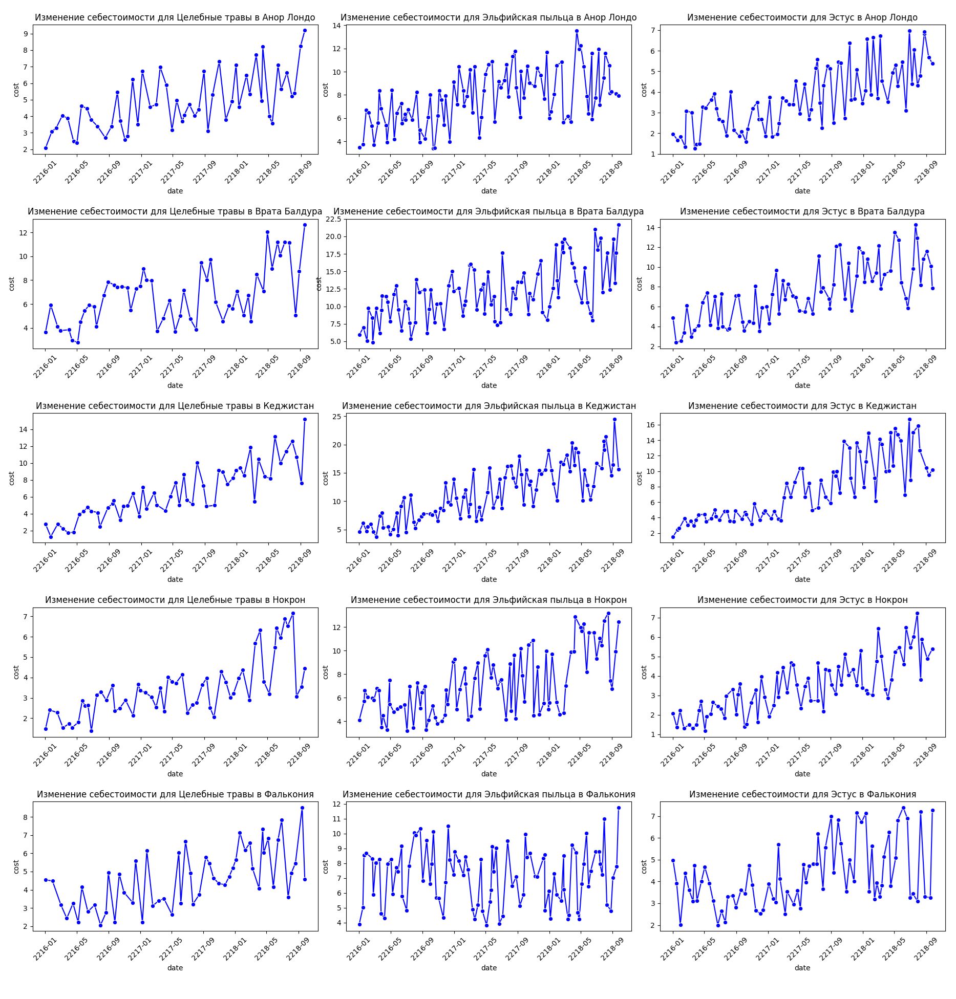
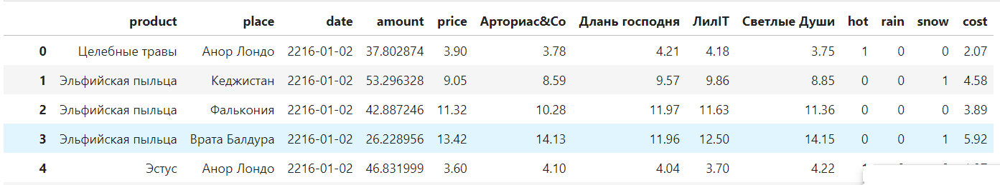

# Отчет о проделанной работе

**Постановка задачи:** Проанализировать данные о товарах в разных городах. Составить прогноз цены на товар 
на 90 дней вперед, учитывая условия указанные [тут](https://drive.google.com/drive/folders/1EhVJR55-NZLPf1Z-VQDgr0BtkYSNjtN1).  
  
**Данные:** Всего было предоставлено 4 набора данных:
* transactions_df - Данные о транзакциях в разных городах по разным позициям с указанием даты
* df_cost - Данные о себестоимости на товары в соответствующих городах
* df_competitors - Данные о ценах у конкурентов на разные позиции
* weather_df - Данные о погоде для каждого дня в разных городах

## Анализ данных, обработка аномалий
### Transactions


В данных было предоставлено 875036 строк. Пропуски в данных было всего 432 в признаке `place`
```python
product       0
price         0
amount        0
place       432
datetime      0
```

Датасет достаточно сбалансированный отностительно категориальных признаков, что можно увидеть на графике ниже.


Изучая численные признаки были найденны аномалии такие, что цена у транзакции или кол-во проданного товара была меньше нуля. Учитывая данную ситуация, было принято решение удалить все транзакции, где встречаются подобные аномалии.

```python
valid_mask = (transactions['price'] >= 0) & (transactions['amount'] > 0) 
transactions = transactions.loc[valid_mask]

transactions.shape # (655976, 5)
```

В итоге получилось, что пришлось удалить около 200 тысяч строк, что достаточно много. Можно было бы подойти к этой проблеме по-другому, установив цену в этот день, которую можно было узанать от ближайшей другой транзакции, а кол-во проданного можно было бы установить как среднее за этот день или предыдущий, где не было бы аномалий. Но в рамках данной задачи я не посчитал это важным, так как в конечном итоге задача сведется к прогнозированию временного ряда, а стоимость продукта для товара в этом городе мы и так знаем без этой тразакции с аномалией.  
Рассмотрим распределение численных признаков после обработки аномалий.


У распределения цены видно выраженный хвост справа, который более наглядно можно наблюдать на графике Box-plot. Вероятней всего этот хвост в рамках этой задачи связан с разницой в цене в разных городах или разнице в цене на определенные продукты.


Также подобный график распределения можно заметить у распределения цены у конкурентов


### Интервал времени
Во всех датасетах интервал времени задан точно от `2216-01-02` до `2218-09-27` включительно

### Погода в городах
Пропусков или аномалий в данных не было обнаружено. Погода предоствлена в формате one-hot-encoding с бинарными признакми `hot`, `rain`, `snow`. При визуализации распределения погоды в данных был добавлен еще один признак `nothing`, который показывает то, что в этот день не было никаких погодных аномалий или по-другому признаки `hot`, `rain`, `snow` равны нулю в этот день.


### Данные о себестоимости 
Таблица хранит себестоимость каждого из товара в каждом из городов, где есть магазины. В данных нет пропусков. Важно заметить, что данные о себестоимости есть не для каждого дня. Рассуждая в рамках поставленной задачи и обсуждения этого вопроса в чат на площадке проводимого мероприятия был сделан вывод о том, что закупки проводились не каждый день, а раз в какое-то время. Поэтому в дальнейшем при использовании знания о себестоимости для какого-то дня использовалось последняя по дате известная себестоимость товара.

### Конкуренты
В данных нет пропусков, представлены четыре конкурента и их цены на товары, которые имеются в нашем магазине. Распределение данных относительно каждого конкурента также имеет сбалансированное распределение


### Агрегация данных для дальнейшего анализа
Датасет transactions представляет из себя набор данных, где содержатся транказации по каждому дню, поэтому было принятно решение сгруппировать данные по дате(учитывая только год, месяц, день), городу, товару, просуммируя кол-во проданного `amount`, а цену агрегировали с помощью среднего значения. Но так как цена в течение дня не может измениться, то после операции взятия среднего она остается такой какой она и была в этот день. Также у нас был признак `datetime`, который хранит дату и время, после агрегации мы оставляем только дату в формате `год-месяц-день`.  
Пример полученного набора данных:  


### Кол-во проданного товара за день
Рассматривая сумарное кол-во проданного товара было получено следующее распределение:  

  
При изучении это признака был проведен визуальный тест на нормальность распределения с помощью Q-Q plot и проведен статистический критерий тест Шапиро-Уилка на определения нормальности распределения. По результатам было принято отклонить нулевую гипотезу о нормальности распределения при p-value = 0.5.  

  
Следующее было проанализировано изменение кол-ва проданного товара за день в течение времени для каждой позиции в каждом городе. Графики получились довольно интересные, никакого тренда на них нет, но четко видно цикличность, которая даже не сезонная, а в рамках нескольких лет. 


### Сравнение цен у конкурентов и у нас в течение времени
Построим временной ряд изменения цен в течение времени для каждого продукта в каждом городе. Рассматривая данные временные ряды точно можно сказать, что ряды нестационарные и имеют явный тренд.  


#### Сравним с тем как изменялась себестоимость
На графиках ниже видно, что в течение времени присутствует тренд, но при этом себестоимость часто скачет, имеет высокую дисперсию.  


### Конкатинация всех имеющихся данных и их анализ
Имея полученные наборы данных, было принято решение объеденить их для изучения влияния признаков друг на друга. Новый датасет принял следующую структуру:  
* `date` - дата в формате `год-месяц-день`
* `place` - название места продажи
* `product` - название продукта
* `price` - цена в нашей организации "Главное пристанище"
* `price_арториас&Сo` - цена в организации "арториас&Сo"
* `price_лилIT` - цена в организации "лилIT"
* `price_длань_господня` - цена в организации "лилIT"
* `price_светлые_души` - цена в организации "светлые_души"
* `cost` - себестоимость продукции 
* `amount` - кол-во проданного нашей огранизацией за день по определенной позиции в определенном городе

#### Важное замечание
В процессе выполнения данного раздела было выявлено то, что не для каждого дня есть показатели цен по каждому из продуктов в каждом из городов по каждому конкуренту *Пример ниже*. В примере видно, что мы за дату `2216-01-04` для продукта `Целебные травы` в городе `Анор Лондо`. Имеем данные только по двум конкурентам. Учитывая, что цену можно изменять раз в три дня. Если по какому-то товару от какого-то конкурента пропущена дата, будем использовать последную известную. Это решение было принято, основываясь на том, что средний интервал кол-ва подряд идущих пропусков в данных по каждому товару у конкурента в определенном городе равен 2.  
Пример про который сказано в абзаце выше:  
  
  
Датасет, который мы получили в итоге:  
  
  
### Анализ линейной зависимости между признаками с помощью коэффициента корреляции
По результатам первичного анализа матрици корреляции была обнаружена линейная зависимость между признаком `price` в нашей организации и ценами у конкурентов с коэффициентом корреляции $0.94-0.95$. Поэтому было принято решение объеденить цены у конкурентов в одну цену с помощью операции среднего значения. Так как эта операция линейная это не повлияет на коэффицент корреляции на выходе мы получим признак с высокой корреляцией с признаком `price`. И избавимся от мультиколлениарности в данных.  
Полученная Карта корреляции:  
  
  
Также можно заметить достаточно высокий коэффициент корреляции у признака `cost` и `price`.

### Зависит ли погода на суммарное кол-во проданного товара:
Разобьем нашу выборку на 4 подвыборки, когда есть дождь, когда стоит жара, когда идет снег и когда нет погодных катаклизмов  
  
**Нулевая гипотеза (H0)**: Нет статистически значимых различий между распределениями групп.  
**Альтернативная гипотеза (H1)**: Существуют статистически значимые различия между распределениями групп.  
  

Учитывая распределение данных было принятно решение использовать критерия Манна-Уитни для установления различий между выборками, сравнивая их попарно.  
  
Полученные результаты:
```
Сравнение между группами rain и snow, P-Value: 0.030839726691402454
Сравнение между группами rain и hot, P-Value: 0.03932712175904761
Сравнение между группами rain и nothing, P-Value: 0.0
Сравнение между группами snow и hot, P-Value: 0.8984407910672827
Сравнение между группами snow и nothing, P-Value: 0.0
Сравнение между группами hot и nothing, P-Value: 0.0
```
  
**Выводы**
Если рассмотреть p-value равным 0.5. То мы не можем отклонить нулевую гипотезу только для случая сравнения `snow` и `hot`.
В остальных случаях можем отклонить нулевую гипотезу, сказав, что есть статистически значимые различия между группами при выбранном p-уровне значимости.

### CatBoost feature importance 
Обучим алгоритм градиентного бустинга для решения задачи регрессии, и сформируем результат влияния признаков на нашу целевую переменную `price`.  
  


### Какой месяц в году является самым прибыльным в среднем за все время
Для анализа данного ворпоса было осуществлено преобразование данных, где данные были сгруппированы по названию продукта, месяцу, городу продажи. Признак `amount` был предварительно перемножен с ценой и была высчитана чистая прибыль учитывая себестоимость в тот момент. Полученное распределение можно посмотреть ниже на графике.
Рассматривая распределение можно сделать вывод, что Ноябрь самый прибыльный месяц в среденем.  
 

### Какой товар приносит больше всего денег
Самым прибыльным товаром получился "Эльфийская пыльца".    


## Прогноз цены на 90 дней вперед
### Подход к решению задачи
Учитывая то, что мы имеем для будущего прогноза только дату, название продукта и название города, то для реализации прогноза построим алгоритм машинного обучения для прогнозирования временного ряда. Использовать будем библиотеку PyCaret, которая предоставляет верхнеуровневые интерфейсы для быстрого изучения и построения различных моделей с их сравнением. Важно отметить, что данная библиотека явялется OpenSource.

### Получение дополнительных признаков
Получим из признака `date` следующие признаки:  
* `day_of_week` - день недели
* `year` - год
* `day_of_year` - номер дня в году
* `month` - месяц  
Такие признаки как день недели, месяц и т.п могут помочь выявить циклические зависимости от дня недели, месяца и т.п, если они есть. 

### Подготовка данных и обучение
Учитыая, что в постановленной задаче у нас имеется три товара и пять городов, где они продаются. Нам нужно будет построить модель/модели для прогнозирование $15$ временных рядов. Каждый временной ряд мы будем прогнозировать по отдельности. Для удобства объеденим признаки place, product в формате place_product. 

#### Обучение и результаты
Процесс обучения был проведен для каждого из 15 наборов по отдельности, используя кросс-валидацию, разделяя набор данных на 3 части. Также из нашего начального датасета была выделана тестовая часть для валидации и оценки модели. Целевой метрикой была выбрана $MSE=\frac{1}{N} \sum_{i=1}^{N}|y_i - \hat{y_i}|$ для удобства интерпритации результата(легкого понимания среднеге отклонения от реальной цены).
  
**Результаты:**  

  

## Прогнозирование
В данном этапе были подготовлены данные в том же формате, в каком модели обучались. И были спрогнозированы результаты. Учитывая условие задачи о том, что стоимость не должна меняться в течение трех дней, а по результатам прогноза было получено то, что в каждой из ячеек было минимальное различие в стоимости, было принято решение пройти окном размера $3$ по каждому из 15ти спрогнозированных поднаборов и установить в них стоимость, которая равняется среднему в этом окне. Запишем это в следующем виде:  
$y\_pred[i:i+3] = \frac{1}{3} \sum_{i=1}^{3} y\_pred_i$, где  
$i_0 = 0$ $...$ $i_{k + 1} = i_{k} + 3$ $...$ $i_{n}=subset\_df.shape[0]$, где subset_df.shape[0] - это кол-во строк в рассматриваемой группе.